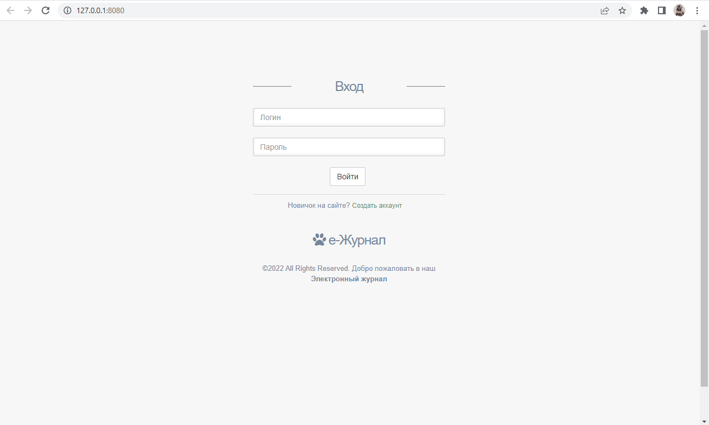
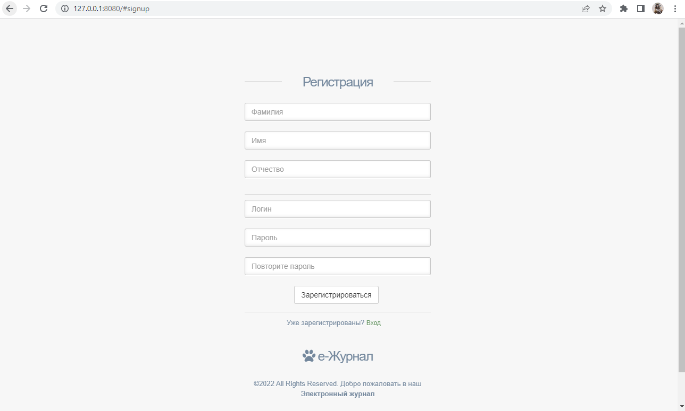
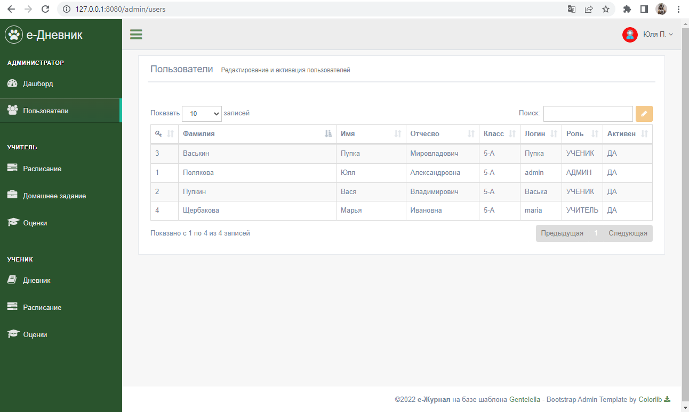
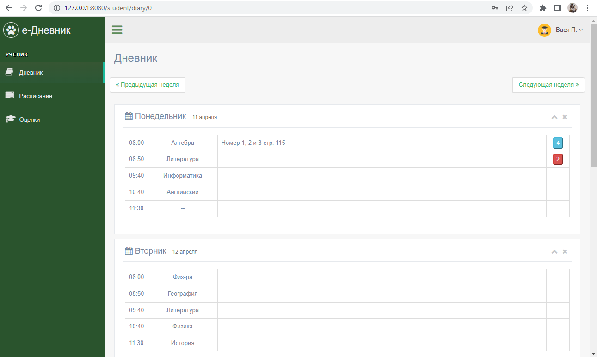
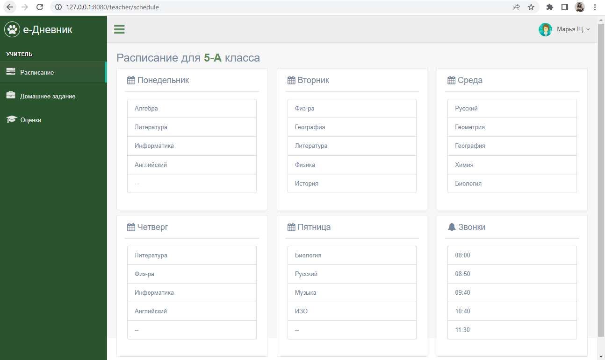

## Название проекта:

Мини Электронный журнал

## Авторы:

Жильцова София Олеговна

Полякова Юлия Александровна

## Идея:

Небольшой электронный журнал для частной школы, где один учитель на весь класс, с возможностью входа, как учитель, ученик и администратор, а также гость.
Учитель может посмотреть свое расписание, добавить домашнее задание, добавить оценку. Ученик - зайти в дневник, посмотреть расписание, посмотреть оценки. Администратор - имеет возможность делать все, в том числе и менять роль пользователям (активировать гостей после регистрации) и корректировать их учетные записи. Гость не может делать ничего, его отправляет на страницу просьбы ожидания активации.

## Реализация:

В основе проекта лежит библиотека flask. Есть база данных, которая создается с помощью sqlalchemy и orm.

*В main.py находится основное приложение со всеми обработчиками, три класса FlaskForm, задекорированная функция для запоминания пользователя и еще несколько вспомогательных функций. Запускается на port=8080.*

#### Обработчики:

1. login() - обрабатывает адрес "/". С помощью этой функции реализована страница логина и регистрации пользователя с добавлением его в БД. На одной странице находятся две формы, они меняют друг друга, если нажать на "Создать аккаунт" или "Вход". Функция возвращает шаблоны login_form.html, если есть ошибки в заполнении или при первой отрисовке страницы, также page_guest.html, если роль человека, который вошел - гость. При регистрации добавляет пользователя в базу данных с ролью - гость.

    Классы форм:
    * LoginForm(FlaskForm). Форма логина пользователя.
    * RegisrationForm(FlaskForm). Форма регистрации пользователя.


2. logout() - обрабатывает адрес "/logout". Здесь применяется встроенная функция logout_user() и делается redirect() пользователя на '/'.
3. page_not_found(e) - страница ошибки "Страница не найдена". Обрабатывает ошибку 404. Возвращает шаблон page_error.html.
4. admin_dashboard() - обрабатывает адрес "/admin/dashboard". Здесь используется render_page(), где указано, что страницей может пользоваться только admin. Это страница, на которой видна информация о пользователях: кол-во классов, пользователей, учителей, студентов, выбывших и ожидающих активации. Возвращает шаблон admin_dashboard.html
5. admin_users() -  обрабатывает адрес "/admin/users". Страница просмотра/редактирования пользователей для администратора. На странице админ в таблице видит всех пользователей и может редактировать их учетную запись (для того, чтобы менять роль пользователей). В render_page() задается список ролей, которым доступна эта страница, то есть ['admin']. Возвращает шаблон admin_users.html.

    * UserEditForm(FlaskForm). Форма редактирования пользователя для страницы /admin/users


6. teacher_schedule() - обрабатывает адрес "/teacher/schedule". Страница расписания занятий для учителя. Заполняет таблицу расписания из БД. По render_page() доступно для ['admin', 'teacher']. Возвращает шаблон teacher_schedule.html.
7. teacher_homework(n) - обрабатывает адрес "/teacher/homework/\<n>". Страница ввода домашних заданий для учителя. Здесь появляется обычная форма, а потом данные из нее добавляются в БД. По render_page() доступна для ['admin', 'teacher']. Возвращает шаблон teacher_homework.html и делает redirect(f"/teacher/homework/{n}"), чтобы было сразу видно изменения.
8. teacher_grade(subj) - обрабатывает адрес "/teacher/grade/\<subj>". Страница добавления оценок для учителя. Оценка тоже добавляется через обычную форму, делается redirect(f"/teacher/grade/{subj}"). Оценки из БД показываются в таблице. По render_page() доступно для ['admin', 'teacher']. Возвращает шаблон teacher_grade.html.
9. student_diary() - обрабатывает адрес "/student/diary/\<n>". Дневник ученика. По дням недени рисуются таблицы с временем, предметом, домашним заданием и оценкой. Есть возможность листать недели. Все данные берутся из БД.  По render_page() доступно для ['admin', 'student']. Возвращает шаблон student_diary.html.
10. student_schedule() - обрабатывает адрес "/student/schedule". Страница расписания занятий для учеников. Заполняет расписание из БД. По render_page() доступно для ['admin', 'student']. Возвращает шаблон teacher_schedule.html.
11. student_grade() - обрабатывает адрес "/student/grade". Показывает оценки учеников со средним баллом. Оценки из БД. По render_page() доступно для ['admin', 'student']. Возвращает шаблон student_grade.html.
12. student_profile() - обрабатывает адрес "/profile". Для отрисовки страницы профиля пользователя. Данные берутся из БД. По render_page() доступно ['admin', 'teacher', 'student']. Возвращает шаблон page_profile.html.

#### Другие функции:

* get_menu(role). Возвращает список пунктов меню, доступных роли.
* render_page(roles, ref, template, **context). Рендерит страницы. 

    Параметры:
  * roles - список ролей, которым доступна страница,
  * ref - адрес страницы,
  * template - имя шаблона,
  * context - список переменных для передачи в шаблон

* render_403(). Рендерит страницу 403. Возвращает шаблон page_error.html.


*В файле push_base.py Находится пример заполнения БД*

**Также у приложения есть свое API:**

Для получения полной информации о классе необходимо сделать запрос в формате: 

"/api/<class_name>"

Пример: "/api/5А"

Пример программы:
```python
import json
import requests

response = requests.get(f'http://127.0.0.1:8080/api/5А')
data = response.json()
print(data)
```


## Реализация базы данных:

**Поскольку БД создается с помощью sqlalchemy и orm, то в файле db_session основные классы и функции для подключения Бд и создания таблиц.**

Таблицы:
* В файле classes.py есть класс Classes(ORMBase), где создается таблица classes с колонками: cl_id, number, letter, schedule, time_schedule.
* В файле grades.py класс Grade(ORMBase), где создается таблица grades с колонками: g_id, date, subject, user_id, grade, reason.
* В файле homeworks.py класс Homeworks(ORMBase), где создается таблица homeworks с колонками: h_id, date, subject, class_id, homework.
* В файле menu.py класс Menu(ORMBase), где создается таблица menu с колонками: id, name, section, title, icon, ref, roles, order.
* В файле role.py класс Role(ORMBase), где создается таблица с колонками: id, name, start_page.
* В файле users.py класс Users(ORMBase, UserMixin), где создается таблица с колонками: id, name, surname, otchestvo, login, password, role, class_id, active.

В файле models.py модели классов.

## Интересные технологии:
1. Стилевые файлы, шаблоны и другие нужные для работы дизайна файлы были взяты из https://colorlib.com/polygon/gentelella/index.html
2. Вместо render_template() использовался render_page(), чтобы ограничить доступ.

## Пользовательский интерфейс







### Библиотеки, необходимые для запуска
```
pip install datetime
pip install flask
pip install flask_login
pip install flask_wtf
pip install wtforms
pip install sqlalchemy
pip install flask_restful
```

### Запуск проекта
Выполнить **main.py**